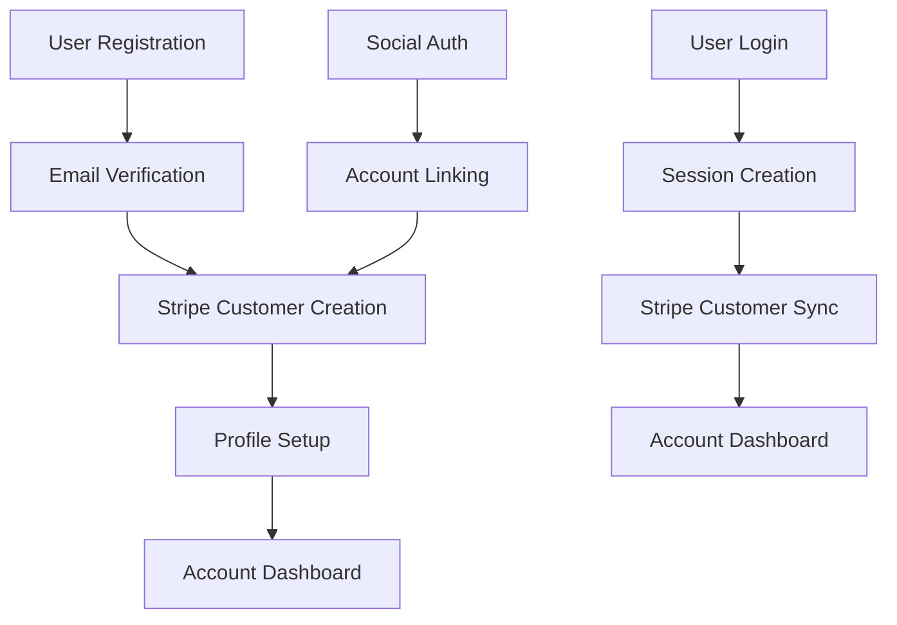

# FuelFoods CPG Authentication System Architecture

## Overview

This document outlines the comprehensive authentication system designed for FuelFoods CPG, integrating seamlessly with the existing Stripe infrastructure while maintaining the brand's green theme and user experience standards.

## Architecture Decisions

### 1. Authentication Strategy: NextAuth.js v5

**Chosen Solution:** NextAuth.js (Auth.js) v5
- **Rationale:** Built for Next.js 15+ App Router, excellent Stripe integration, battle-tested security
- **Features:** JWT sessions, social auth, CSRF protection, TypeScript support
- **Stripe Integration:** Direct customer sync capabilities

### 2. Database Strategy: Prisma + PostgreSQL

**Schema Design:**
```sql
-- Core authentication tables
users, accounts, sessions, verification_tokens

-- FuelFoods-specific tables
addresses, user_subscriptions, orders, payment_methods
```

### 3. Session Management

**Approach:** Hybrid JWT + Database Sessions
- **JWT:** For stateless authentication checks
- **Database:** For sensitive operations and user data
- **Security:** httpOnly cookies, CSRF tokens, secure headers

## System Components

### 1. Authentication Flow



### 2. API Routes Structure

```
/api/auth/
├── [...nextauth]/route.ts          # NextAuth configuration
├── register/route.ts               # Custom registration
├── verify-email/route.ts          # Email verification
└── forgot-password/route.ts       # Password reset

/api/user/
├── profile/route.ts               # User profile management
├── addresses/route.ts             # Address management
├── preferences/route.ts           # User preferences
└── delete-account/route.ts        # Account deletion

/api/stripe/
├── customer/route.ts              # Customer sync operations
├── subscriptions/route.ts         # Subscription management
├── payment-methods/route.ts       # Payment method handling
└── webhook/route.ts              # Enhanced webhook handler
```

### 3. Middleware Strategy

**Authentication Middleware:**
```typescript
// Protect routes: /my-account/*, /checkout/*
// Redirect unauthenticated users to /login
// Preserve intended destination
```

**Authorization Levels:**
- **Public:** Home, products, about
- **Authentication Required:** Checkout, account dashboard
- **Email Verified:** Subscription management
- **Admin:** Order management (future)

## User Experience Flow

### 1. Registration Process

1. **Initial Registration** (Enhanced existing `/register`)
   - Collect: firstName, lastName, email, phone, password
   - Validate: Email uniqueness, password strength
   - Create: Database user, Stripe customer
   - Send: Email verification

2. **Email Verification**
   - Verify email before full account activation
   - Enable subscription management post-verification

3. **Profile Completion**
   - Optional: Complete profile information
   - Add: Default shipping address
   - Set: Communication preferences

### 2. Account Dashboard

**Sidebar Navigation Structure:**
```
Dashboard
├── Overview (default)
├── Orders
├── Downloads (future: receipts, invoices)
├── Addresses
│   ├── Shipping Addresses
│   └── Billing Addresses
├── Payment Methods
├── Account Details
│   ├── Profile Information
│   ├── Email Preferences
│   └── Password Change
└── Logout
```

**Dashboard Features:**
- **Welcome Section:** Personalized greeting, next delivery info
- **Quick Stats:** Total orders, active subscriptions, savings
- **Active Subscriptions:** Manage, pause, modify subscriptions
- **Recent Orders:** Order history with tracking
- **Quick Actions:** Add subscription, update payment method

### 3. Checkout Integration

**Authentication in Checkout:**
1. **Guest Checkout:** Collect email, offer account creation
2. **Authenticated:** Auto-fill shipping/billing from saved addresses
3. **Post-Purchase:** Create account for guest checkouts
4. **Subscription Handling:** Require authentication for subscriptions

## Security Implementation

### 1. Password Security

```typescript
// Password requirements
const passwordSchema = {
  minLength: 8,
  requireUppercase: true,
  requireLowercase: true,
  requireNumbers: true,
  requireSymbols: false,
  preventCommonPasswords: true
}
```

### 2. Session Security

```typescript
// NextAuth.js configuration
export const authOptions = {
  session: {
    strategy: 'jwt',
    maxAge: 30 * 24 * 60 * 60, // 30 days
  },
  cookies: {
    sessionToken: {
      name: 'fuelfood.session-token',
      options: {
        httpOnly: true,
        sameSite: 'lax',
        path: '/',
        secure: process.env.NODE_ENV === 'production'
      }
    }
  }
}
```

### 3. API Security

- **Rate Limiting:** Protect auth endpoints from brute force
- **Input Validation:** Zod schemas for all API inputs
- **CSRF Protection:** Built-in NextAuth.js protection
- **SQL Injection:** Prisma ORM with prepared statements

## Stripe Integration Strategy

### 1. Customer Lifecycle

```typescript
// User registration → Stripe customer creation
// User profile updates → Stripe customer updates
// Account deletion → Stripe customer archival
```

### 2. Subscription Management

```typescript
// Stripe webhooks → Database sync
// User changes → Stripe API calls
// Billing events → Email notifications
```

### 3. Payment Methods

```typescript
// Stripe SetupIntents for saving cards
// Payment method management in account dashboard
// Default payment method handling
```

## Theme Integration

### 1. Color Scheme Consistency

```css
/* Authentication pages use existing FuelFoods green theme */
--fuelfoods-green-500: #178641; /* Primary brand green */
--fuelfoods-green-600: #136834; /* Hover states */
--fuelfoods-green-50: #f0fdf4;  /* Light backgrounds */
```

### 2. Component Styling

- **Forms:** Consistent with existing checkout forms
- **Buttons:** FuelFoods green with hover effects
- **Alerts:** Green success, red error states
- **Dashboard:** Clean white cards with green accents

## Performance Considerations

### 1. Authentication Checks

```typescript
// Lightweight session verification
// Minimal database queries for protected routes
// Client-side state management with React Context
```

### 2. Stripe API Optimization

```typescript
// Batch customer updates
// Webhook event deduplication
// Subscription data caching
```

## Testing Strategy

### 1. Authentication Tests

- **Unit Tests:** Auth helper functions, validation schemas
- **Integration Tests:** API routes, database operations
- **E2E Tests:** Complete registration/login flows

### 2. Stripe Integration Tests

- **Webhook Testing:** Stripe CLI for local development
- **Customer Sync:** Test customer creation/updates
- **Subscription Flows:** Test subscription lifecycle

## Deployment Considerations

### 1. Environment Variables

```bash
# NextAuth.js
NEXTAUTH_URL=https://your-domain.com
NEXTAUTH_SECRET=your-secret-key

# Database
DATABASE_URL=postgresql://...

# Email (for verification)
EMAIL_SERVER=smtp://...
EMAIL_FROM=noreply@fuelfoodscpg.com

# Stripe (existing)
STRIPE_SECRET_KEY=sk_...
STRIPE_WEBHOOK_SECRET=whsec_...
```

### 2. Database Migration Strategy

```bash
# Prisma migrations for production deployment
npx prisma migrate deploy
```

## Future Enhancements

### 1. Phase 2 Features

- **Admin Dashboard:** Order management, customer support
- **Advanced Analytics:** User behavior tracking
- **Loyalty Program:** Points and rewards system
- **Mobile App Support:** API-first architecture

### 2. Security Enhancements

- **Two-Factor Authentication:** SMS/TOTP support
- **Advanced Fraud Detection:** Integration with Stripe Radar
- **Audit Logging:** Security event tracking

## Implementation Timeline

### Phase 1: Core Authentication (Week 1-2)
- NextAuth.js setup and configuration
- Database schema and migrations
- Basic registration/login flows
- Email verification system

### Phase 2: Account Dashboard (Week 2-3)
- Complete dashboard implementation
- Address and payment method management
- Order history integration
- Profile management

### Phase 3: Stripe Integration (Week 3-4)
- Enhanced webhook handling
- Customer synchronization
- Subscription management
- Payment method storage

### Phase 4: Testing & Deployment (Week 4-5)
- Comprehensive testing suite
- Security auditing
- Performance optimization
- Production deployment

## Conclusion

This authentication system architecture provides:

✅ **Seamless Integration:** Works with existing Stripe infrastructure
✅ **Brand Consistency:** Maintains FuelFoods green theme
✅ **Security First:** Industry-standard security practices
✅ **Scalable Design:** Ready for future feature additions
✅ **User-Friendly:** Intuitive dashboard matching the provided screenshot
✅ **Developer Experience:** Type-safe, well-documented, testable

The system will transform your existing static authentication pages into a fully functional, production-ready authentication system that enhances user experience while maintaining security and performance standards.